## jmeter测试手册

### 下载地址

http://jmeter.apache.org/download_jmeter.cgi

根据自己测试的系统选择

### 目录结构

`bin`:运行jmeter的脚本和配置文件目录

`lib`:依赖的jar包目录，可存放自己扩展的测试jar包

`licenses`:授权文件目录

`printable_docs`:文档目录

### 运行环境

jmeter3.0需要java7以上版本的支持

### 图形界面测试

以window平台为例

运行`jmeter.bat`即可启动jmeter图形界面

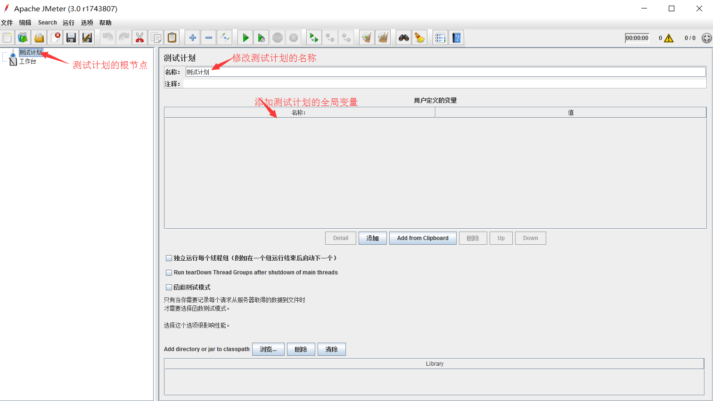

右键点击`测试计划`添加线程组

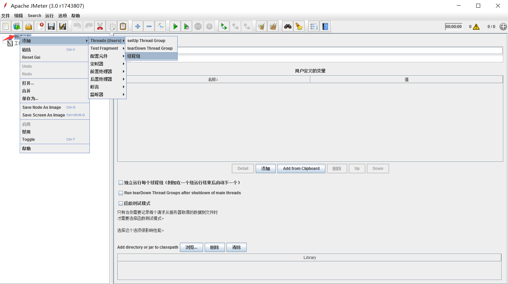

线程组配置界面

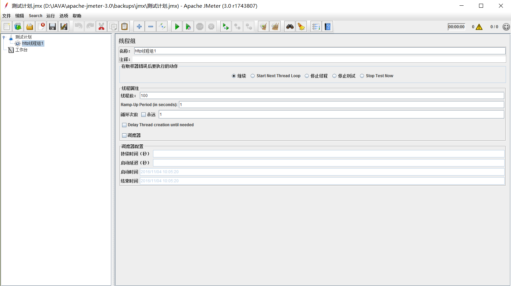


因为平时测试http请求的场景较多，所以根据使用场景分下面两种情况测试

#### 简单的http请求

右键点击线程组，添加http请求用例

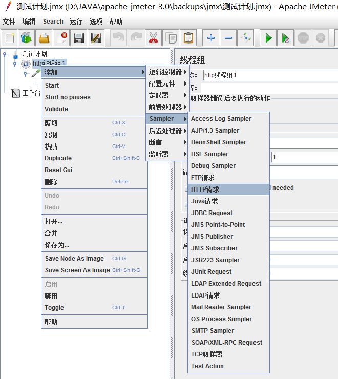

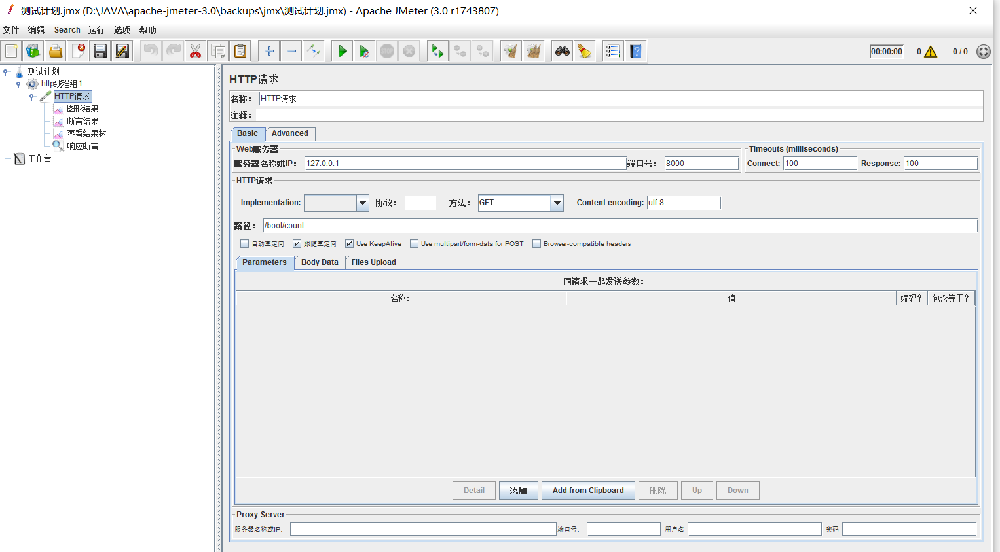

为http请求添加响应断言

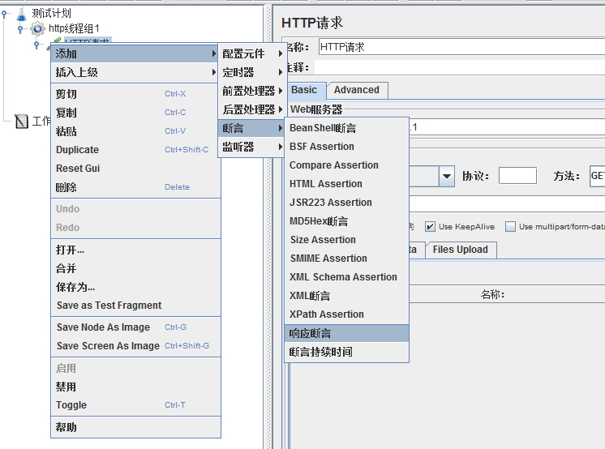

可根据不同的请求类型配置校验

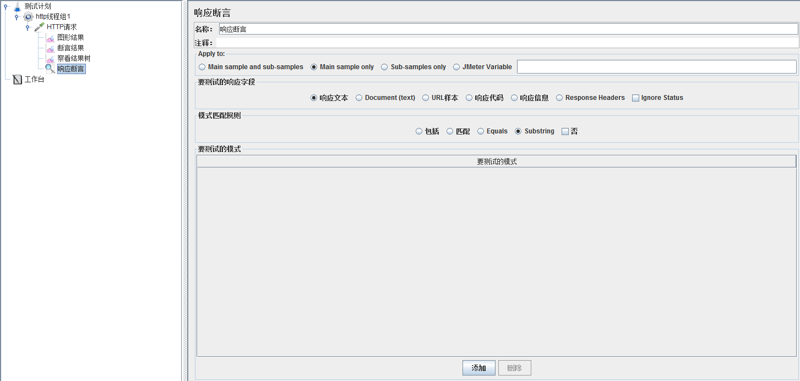


右键点击刚刚创建的http用例，添加监听器

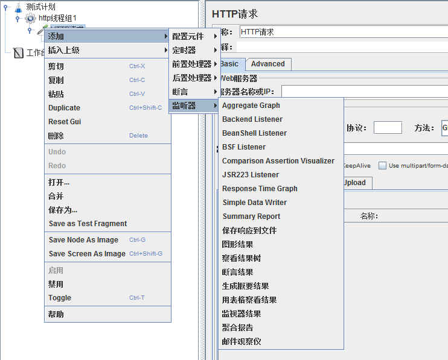

可根据场景添加需要的监听器。（通常会添加图形结果、查看结果树、断言结果等）


以本机的一个简单http请求为例查看测试结果（100个线程，循环100次）

图形结果可查看吞吐量

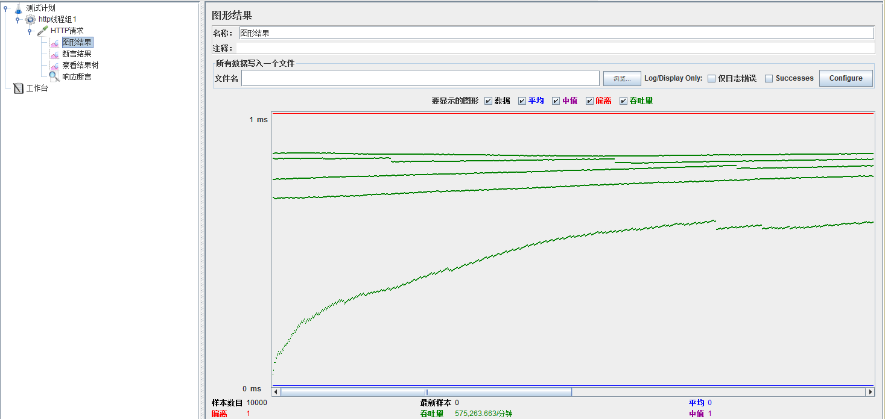

结果树可以查看每次请求的详情

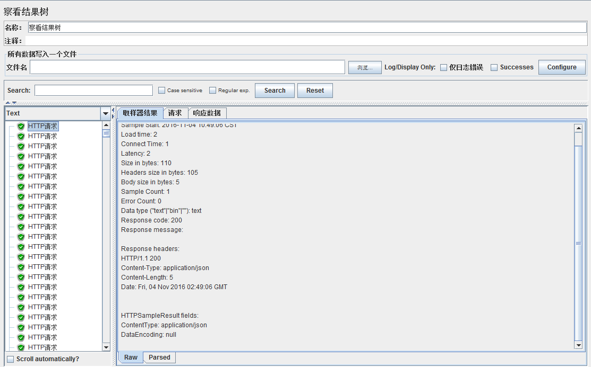

#### java请求

java请求可以执行定制的java类来进行测试，需要继承`org.apache.jmeter.protocol.java.sampler.AbstractJavaSamplerClient`或实现`org.apache.jmeter.protocol.java.sampler.JavaSamplerClient`接口，并实现其中的方法。

##### 示例

```
import org.apache.http.client.methods.CloseableHttpResponse;
import org.apache.http.client.methods.HttpGet;
import org.apache.http.impl.client.CloseableHttpClient;
import org.apache.http.impl.client.HttpClients;
import org.apache.http.util.EntityUtils;
import org.apache.jmeter.protocol.java.sampler.AbstractJavaSamplerClient;
import org.apache.jmeter.protocol.java.sampler.JavaSamplerContext;
import org.apache.jmeter.samplers.SampleResult;
import java.io.IOException;
import java.util.regex.Matcher;
import java.util.regex.Pattern;

public class TestJmeter extends AbstractJavaSamplerClient {
    @Override
    public SampleResult runTest(JavaSamplerContext javaSamplerContext) {//必须复写测试的主方法
        String param1=javaSamplerContext.getParameter("param1","000");//获取参数并设置默认值
        String url=javaSamplerContext.getParameter("url","http://127.0.0.1:8000/boot/count");
        CloseableHttpClient client = HttpClients.createDefault();
        HttpGet httpGet = new HttpGet(url);
        SampleResult sr = new SampleResult();
        sr.setSampleLabel(param1);
        sr.sampleStart();//开始测试，作为jmeter测试的结果数据
        try {
            CloseableHttpResponse response = client.execute(httpGet);
            String result = EntityUtils.toString(response.getEntity());//服务器返回的数据
            sr.setResponseData(result,"utf-8");
            Pattern pattern = Pattern.compile("^[1-9]\\d*$");
            Matcher matcher = pattern.matcher(result);
            boolean flag =matcher.matches();
            sr.setSuccessful(flag);//设置测试是否成功
        } catch (IOException e) {
            e.printStackTrace();
        }finally {
            sr.sampleEnd();//结束测试，作为jmeter测试的结果数据
        }
        return sr;
    }
}
```


##### 可以重写的其他方法

`public Arguments getDefaultParameters()`

这个方法由Jmeter在进行添加javaRequest时第一个运行，它决定了你要在GUI中默认显示出哪些属性。如不重写此方法，在调用该测试用例时，jmeter无法获取需要的参数名称，录入的参数也不能保存到jmx文件中。

`public void setupTest(JavaSamplerContext context)`

这个方法相当于loadrunner中的init，我们可以用它来进行一些初始化的动作。

`public SampleResult runTest(JavaSamplerContext context)` 

这个方法相当于loadrunner中的action，我们的核心测试代码就在这里了。

`public void teardownTest(JavaSamplerContext context)` 

这个方法相当于loadrunner中的end，收尾的工作可以由它来做。

##### jmeter测试java请求

将刚刚的编写的测试代码打成jar包，与其依赖包共同放在jmeter安装目录下的lib/ext下，然后启动jmeter

右击线程组，添加java请求

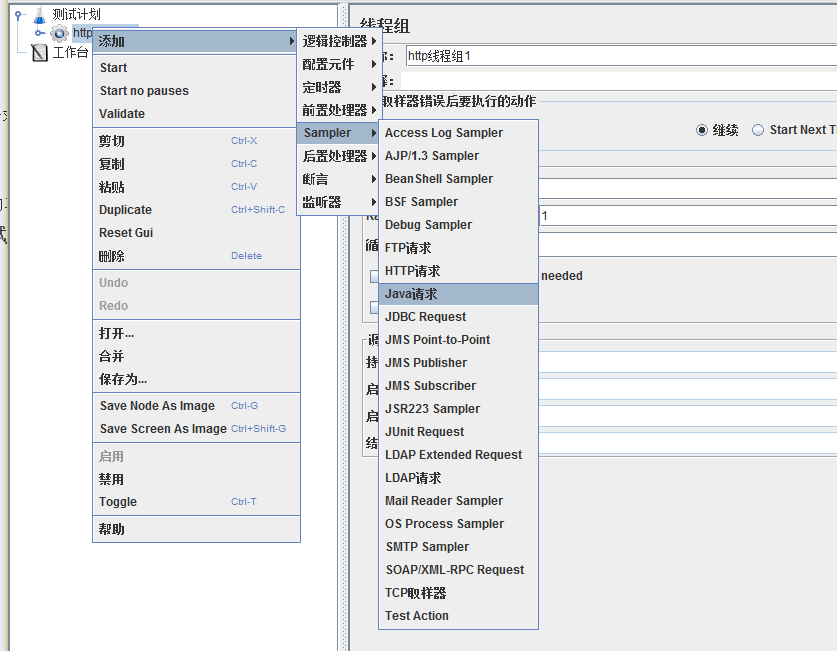

为选择测试的java类，并设置java请求的参数

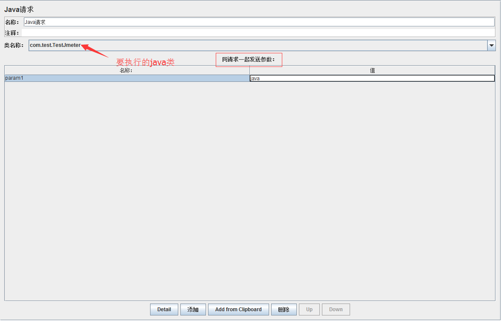

图形结果和查看结果树与HTTP请求的查看方式相同。


### 命令行使用jmeter进行测试

命令行可用于单客户机测试和远程集群测试，远程集群测试依赖于服务器运行jmeter-server

#### 测试命令

在jmeter图形界面将测试计划或线程组保存为jmx文件（其中的格式是xml，也可以用文本编辑器来编写）

执行命令

`jmeter.bat -n -t templates/testPlan.jmx -l a.jtl`

参数说明

```
-n This specifies JMeter is to run in non-gui mode 	//命令行模式
-t [name of JMX file that contains the Test Plan]  	//要使用的jmx文件
-l [name of JTL file to log sample results to]		//测试结果文件
-j [name of JMeter run log file]					//日志文件
-r Run the test in the servers specified by the JMeter property "remote_hosts" //远程测试，测试服务器在				jmeter.properties中的remote_hosts指定，多个用逗号隔开。java请求需要将测试jar及依赖jar添加到				远程jmeter的lib目录
-R [list of remote servers] Run the test in the specified remote servers //指定远程测试主机
-g [path to CSV file] generate report dashboard only
-e generate report dashboard after load test
-o output folder where to generate the report dashboard after load test. Folder must not exist or be 					empty.The script also lets you specify the optional firewall/proxy server information:

-H [proxy server hostname or ip address] 	//代理主机地址
-P [proxy server port]						//代理主机端口
```

#### 查看测试结果

可以使用文本方式直接打开 a.jtl,也可以使用jmeter图形界面查看。可以在图形结果、查看结果树界面或其他监听器导入a.jtl进行查看。

### 


