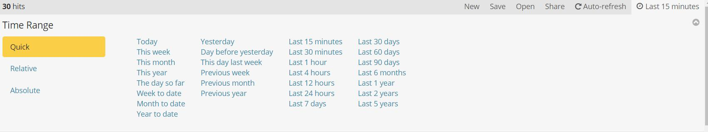
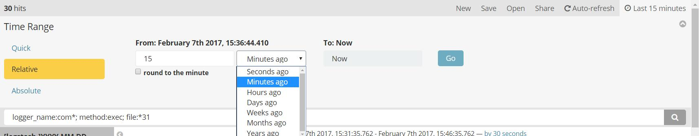
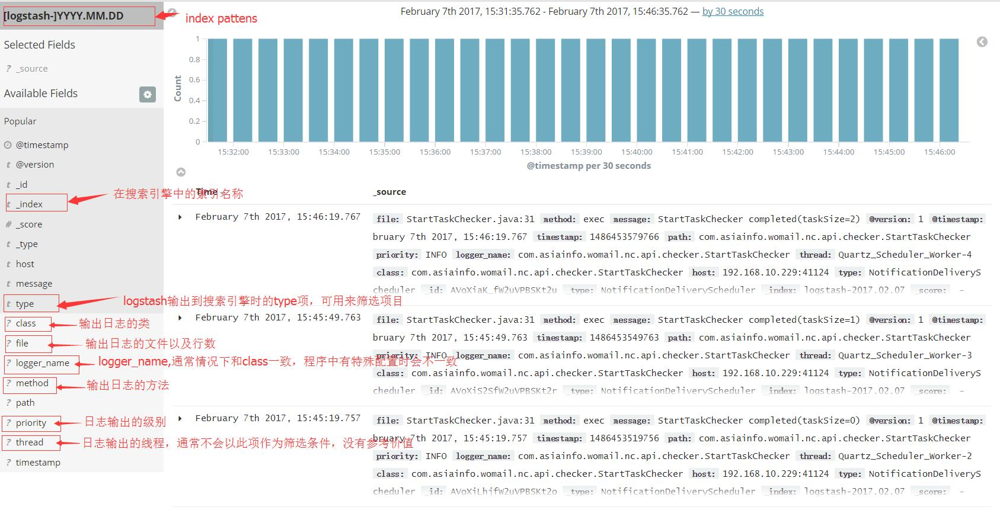

# logstash日志归集使用文档

日志归集系统采用logstash接收各个系统输出的日志并发送到kafka，然后从kafka获取日志信息输出到elasticsearch做全文索引，由kibana做日志的展示

因为5.0-5.1版本的logstash中的log4j插件不能正常使用，所以需要使用2.4.0版本从接收日志信息。其他组件可使用官方最新的稳定版本。

## logstash 2.4

下载地址 https://www.elastic.co/downloads/past-releases/logstash-2-4-0

由于logstash官网上已找不到官方文档，所以只列出下面的简单配置。

### 配置文件

在conf目录下新建ndsLog.conf，作为接收日志信息并输出到kafka的配置文件

```json
input{
   log4j{ //使用logstash的log4j插件，可使用多个，但是端口不能重复
       host =>"0.0.0.0" //使用本机ip，服务器有多个网卡时，建议绑定一个确定的ip
       port =>4560
       type =>"NotificationDeliveryScheduler"  //可作为项目名称区分
   }
}

output {
    stdout { codec => rubydebug }
    kafka{
        bootstrap_servers =>"192.168.10.229:9092"  //kafka的访问地址   
        topic_id =>"nds"  //topic
    }
}
```

在conf目录新建kafka-input.conf，作为从kafka收取数据并写入搜索引擎的配置文件

```json
input{
   kafka{
       zk_connect =>"192.168.10.229:2181"  //kafka连接的zookeeper地址
       topic_id =>"nds"
   }
}

output {
    stdout { codec => rubydebug }
    file {
        path => "/opt/data/java/logstash/logstash/logs/ndsLog-%{+YYYY-MM-dd}.log"
	   codec => plain 
    }
    elasticsearch { //写入搜索引擎
      hosts => ["192.168.10.229:9200"] 
      index => "logstash-%{+YYYY.MM.dd}"
    } 
}
```

**实际使用时需要删除上述配置文件中的注释方可使用**

### 启动

-f指定配置文件，-r可以实时获取配置文件的更新

```shell
开始接受应用日志: nohup ./bin/logstash -f conf/ndsLog.conf -r &
开始从kafka收取日志： nohup ./bin/logstash -f conf/kafka-input.conf -r &
```

### log4j接入logstash

```properties
log4j.logger.logstash=INFO
log4j.appender.logstash=org.apache.log4j.net.SocketAppender
#logstash所在ip
log4j.appender.logstash.RemoteHost=192.168.10.229
#logstash占用的端口
log4j.appender.logstash.Port=4560
log4j.appender.logstash.layout=org.apache.log4j.PatternLayout
log4j.appender.logstash.layout.ConversionPattern=%d [%-5p] [%l] %m%n
log4j.appender.logstash.ReconnectionDelay=10
log4j.appender.logstash.LocationInfo=true
```


## logstash 5.2

logstash 5.2版本修复的log4j插件的问题。下面只列出已验证可以正常使用的插件。同一个配置可以配置一个或者多个输入插件和输出插件，但是至少要分别配置一个输入插件和输出插件，否则日志信息将会丢失。一个配置文件中的输入和输出插件不要配置同一个地址的消息队列或者缓存（例如redis），否则会导致日志信息无限循环。

最新版本logstash的下载地址：https://www.elastic.co/downloads/logstash

文档地址：https://www.elastic.co/guide/en/logstash/5.2/index.html

下面只列出几个插件的简单配置，更多插件的配置请看官方文档的`input plugins` 和`output plugins`。

```json
input{
  //输入插件
}
output{
  //输出插件
}
```


### 输入插件

#### log4j

日志的初始来源

```json
log4j{
       host =>"192.168.221.129" //本机地址
       port =>4560 //接收log4j日志的端口
       type =>"ss"  //日志来源的标记
   }
```

应用中log4j的配置与使用logstash 2.4时相同。

#### stdin

接收从命令行输入的信息，只测试搭建环境是否正常时使用，正常使用的其他的环境下建议不要使用。

```json
std{
  type =>"ss"
}
```

#### redis

```json
redis{
   	host =>"192.168.10.116" //redis服务的地址
  	port => 6379 //redis服务的端口
	key => "redis-test" //从redis中获取日志时的key
	data_type => "list" //数据类型，与输出到redis时的类型保持一致 	
}

```

### 输出插件

#### stdout

控制台输出插件，尽在搭建环境初期作为验证环境是否正常的手段，其他环境下建议不要使用，会降低logstash的性能。

```json
stdout { codec => rubydebug }
```

#### file

输出到文件

```json
file {
   path => ...
   codec => line { 
   		format => "custom format: %{message}"  //可根据规则自定义
   } 
}
```

`format`值中`%{}`里包含的是log4j输出的字段，有以下字段可以选择

```
timestamp ⇒ 日志输出时的时间戳
path ⇒ logger名称
priority ⇒ 日志输出级别
logger_name ⇒ logger名称
thread ⇒ 日志输出所属的线程
class ⇒ 输出日志的完整类名
file ⇒ 文件名：所在行数
method ⇒ 输出日志的方法名
type ⇒ 输入插件中定义的type
```

#### redis

```json
redis{
   	host =>"192.168.10.116" //redis服务的地址
  	port => 6379 //redis服务的端口
	key => "redis-test" //从redis中获取日志时的key
	data_type => "list" //数据类型，5.2版本"channel"无法生效，所以只有"list"可选。	
}

```


## kibana

下载地址 https://www.elastic.co/downloads/kibana

### 配置

在`config/kibana.yml`文件中修改`server.port: 5601`来修改绑定的端口，修改`server.host: "0.0.0.0"`来绑定ip使其他ip可以访问。修改`elasticsearch.url : "http://localhost:9200"`来指定elasticsearch的访问地址。

### 启动

```shell
bin/kibana
```

启动后访问kibana.yml中配置的地址和端口，会要求配置Index Patterns，可指定为 [logstash-]YYYY.MM.DD（因为在上述配置文件中指定的输出到elasticsearch的index名称为`logstash-%{+YYYY.MM.dd}`）。

之后可以使用`Discover`菜单来查询日志。

### 日志筛选

#### 按时间筛选

进入Discover菜单后，点击页面右上角的时间，即可看到以下时间选择的选项



Quick为快速选择，其下的选项为则一些常用的时间选项。




Relative下课选择从现在之前的一段时间。

Absolute可以自由选择准确的开始时间和结束时间

#### 按日志信息筛选

通常情况下，由log4j输出的日志在kibana中查看时会有以下信息可以查看



默认情况下，日志信息页面上方会显示柱状图，下方为日志信息列表，有时间和源信息两列。当鼠标移动到`Available Fields`下的选项时，该选项的右侧有出现`add`按钮显示，点击按钮，该选线则会出现在`Selected Fields`下方，日志信息列表中的`_source`会隐藏，添加的字段则作为日志信息列表新的一列，可添加多个列到列表。

`Available Fields`下所有的项都可以作为筛选字段在搜索框中进行筛选，规则为 

```
字段名:匹配值 AND ... AND 字段名:匹配值
```

其中，匹配值支持*做模糊匹配，多个条件之间使用AND连接。

例如`logger_name:com* AND method:exec AND file:StartTaskChecker*`，则会查询logger_name为com开头、method为exec、file为StartTaskChecker开头的日志信息。


## Elasticsearch

下载地址 https://www.elastic.co/downloads/elasticsearch

### 配置

在`config/elasticsearch.yml `中加入`http.host : 0.0.0.0`,使其他机器可以访问elasticsearch，当服务器有多个网卡时，绑定其中一个ip即可，修改`http.port: 9200`可改变绑定的端口。

### 启动

```shell
nohup bin/elasticsearch &
```

### 删除索引

```shell
curl -XDELETE 'http://localhost:9200/logstash-*'
```

上面的命令会将以`logstash-`开头的日志索引全部删除。如果要删除指定时间的日志索引，则可以

```shell
curl -XDELETE 'http://localhost:9200/logstash-2017.02.17'    #删除2017年2月17日的日志索引
curl -XDELETE 'http://localhost:9200/logstash-2017.*'    #删除2017年的日志索引
curl -XDELETE 'http://localhost:9200/logstash-2017.02.*'    #删除2017年2月的日志索引
curl -XDELETE 'http://localhost:9200/logstash-2017.02.1*'    #删除2017年2月10日-2月19日的日志索引
```

日期格式需要根据logstash写入Elasticsearch的格式进行匹配。